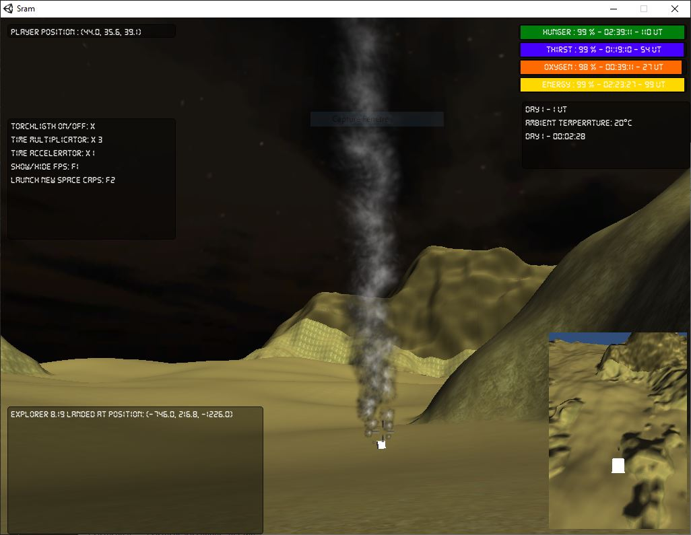

## S.R.A.M

A Unity pet project. Work in progress.

S.R.A.M means nothing. It's just the reversed name of the planet Mars.

A survival and exploration video game prototype :
- Exploration of an unknown planet generated randomly.
- 3D minimap.
- Space capsule can land on the map. Landing position appears in the logs. 
- Interact with the space capsules to pick the supplies they contain.
- Don't follow the sun.

## Shortcuts
- Move player: W/A/S/D by default
- Throw new space capsule: F2
- Interact with space capsules: F
- Light on/off: X
- Show/hide inventory: I
- Show/hide FPS: F1
- Speed up time: page up
- Slow down time: page down

## Downloads

You can download a zip archive ici: [zip archive](./sram%20prototype%200.0.1.zip)
- Windows OS: run sam.exe
- Other OS: open the ouput.html file in your favorte browser. You may need to install the [Unity Web Player](https://unity3d.com/webplayer/).

